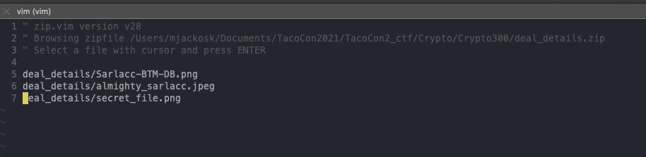

# Crypto 300 - Sarlacc

## Challenge Text: 

We recovered this file with one of our drive by spear-phishing attacks on the Emprie. We beleive it contains important information on the Sarlacc creature of Tatooine. Could this mean that Jabba and the Empire have struck some sort of deal? 

[Link to files](https://challenges.silicon-ctf.party/crypto300/captured.zip)

## Hints: 

Do you have any contents of the encrypted file already?

## How to solve: 

The idea behind this challenge is to conduct a known plaintext attack against the encrypted zip file that is provided. 

Within the file dump we receive in this challenge, there is an encyrpted zip file and a jpeg called "almighty_sarlacc.jpeg". 

Even though the zip file is encrypted, we can see what is inside by opening up the zip file in a text editor: 

Here we can see that one of the files in the zip file, we already have: "almighty_sarlacc.jpeg". 

We can use a tool called pkcrack to conduct our attack. 

First, we zip the jpeg we have, then we can use the command: 

`./pkcrack/bin/pkcrack -C deal_details.zip -c 'deal_details/almighty_sarlacc.jpeg' -P almighty_sarlacc.zip -p almighty_sarlacc.jpeg -d out -a`

This will eventually crack the zip right open and allow us to get the flag from one of the images inside. 