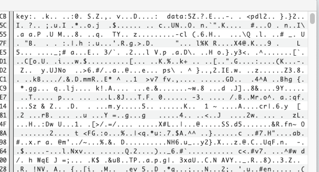
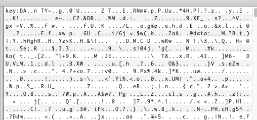

# Crytpo400 - DarkSide

## Challenge Text: 

Our servers were hit with the DarkSide ransomware! (same ransomware that hit the colonial pipeline - that software really held up over time). 

Our elite group of hackers were able to get a private key from the attackers. Can you help to figure out how to decrypt our files?

[Link to File](https://challenges.silicon-ctf.party/crypto400/crypto400_files.zip)

[Link to fixed Files 1](https://challenges.silicon-ctf.party/crypto400/crypto400_second.zip)

[Link to fixed Files 2](https://challenges.silicon-ctf.party/crypto400/ok_this_one_should_work.zip)

***The third link contains the fixed files for this challenge. The files in the first and second link can be used to solve this challenge. But the third link has updated files. Please note - the zip files contain files generated with different keys***

## Hints: 

Check out how DarkSide Ransomware works - look at the encryption mechanism

[FireEye Article](https://www.fireeye.com/blog/threat-research/2021/05/shining-a-light-on-darkside-ransomware-operations.html)

## How to solve: 

Admittedly there were some problems with this challege in the beginning. So there were two ways to solve. 

In the file dump for this challenge you are given a private key and an encrypted file. 

A lot of Ransomware encrypts files using a symmetric key and then encrypts the symmetric key used to encrypt the file with a private asymmetric key. Looking specifically at the Darkside Ransomware, the files are encrypted with a symmetric key using the Salsa20 algorithm. Then that key is encrypted with a private RSA key. This is done to keep the symmetric key away from defenders. 

However, if a defender has the Ransomware's private key, it is possible to recover the symmetric key and then recover the file. 

In the "Fixed Files 1", if you open up the encrypted file you will see: 

There is a "key" value that is 32 bytes long. This is obviously not RSA encrypted data. This is in fact the key used in the Salsa20 algorithm to encrypt the rest of the data. 

This is soltuion 1. 

In the "Fixed Files 2", if you open up the encrypted file you will see: 

The key value here is 256 bytes long. This data can be decrypted using the private RSA key given in the challenge. Once the key is decrypted, it can be used to decrypt the rest of the data in the file - stored after the "data" tag. 