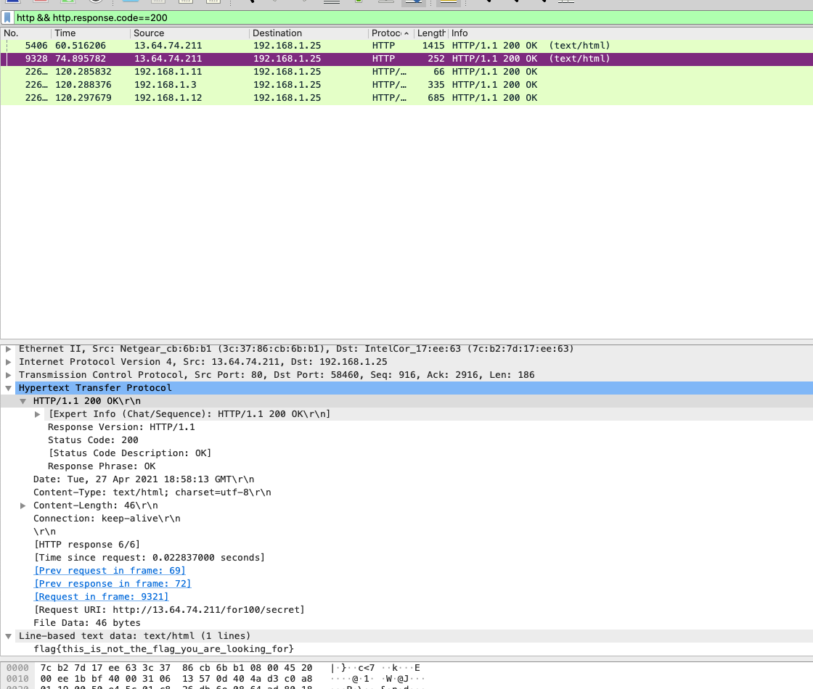
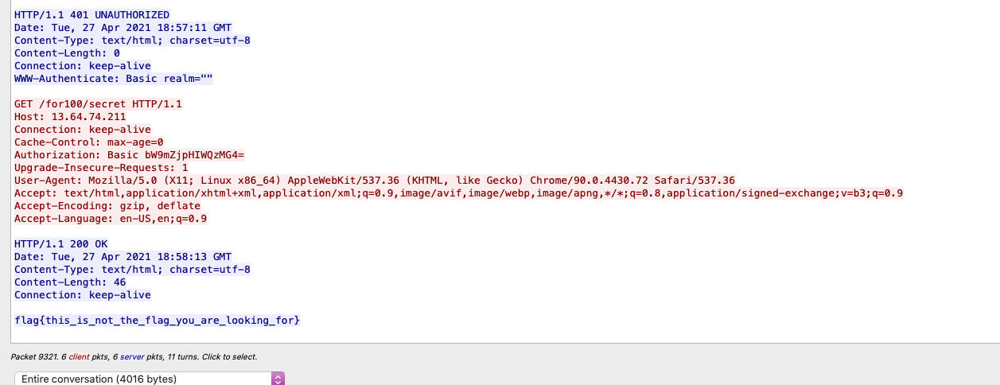
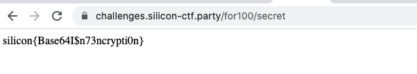

# Forensics 100 - new login who dis?

## Challenge Text: 

Our hacker team was able to perform a man-in-the-middle attack on one of the empire generals. The attack generated this pcap file. Can you look through it to see if there is anything interesting? 

[Link to PCAP](https://challenges.silicon-ctf.party/for101/WhoAmI.pcap.gz)

## Hints

1. What is happening in the PCAP file? Does the HTTP traffic contain anything sensitive?

2. Once you've found the sensitive info, check the link to see where to use it

## How to Solve: 

To solve this challenge, open up the pcap in wireshark. 

Look for the http traffic with the response code of 200

You can do this with the filter `http && http.response.code==200`



The second packet here has a flag in it.. This is not the flag we are looking for, but lets look at this traffic a little more and see if there is anything interesting. 

You can do this by right clicking the packet and selecting "Follow" -> HTTP Stream. 



At the bottom of the stream we can see the request that gave the response. In the request there is a header: 

```
Authorization: Basic bW9mZjpHIWQzMG4=
```
This is the header for Basic Auth. Basic Auth is just base64 encoded username and password. 

```
~ ❯ echo bW9mZjpHIWQzMG4= | base64-d                                                                        
moff:G!d30n%
```

The request was reaching out to `http://13.64.74.211/for100/secret` 

If we replace the beginning part with the challenge server we get: `https://challenges.silicon-ctf.party/for100/secret`

Navigate there and login with those credentials: 

