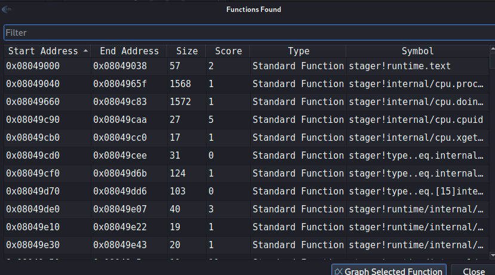
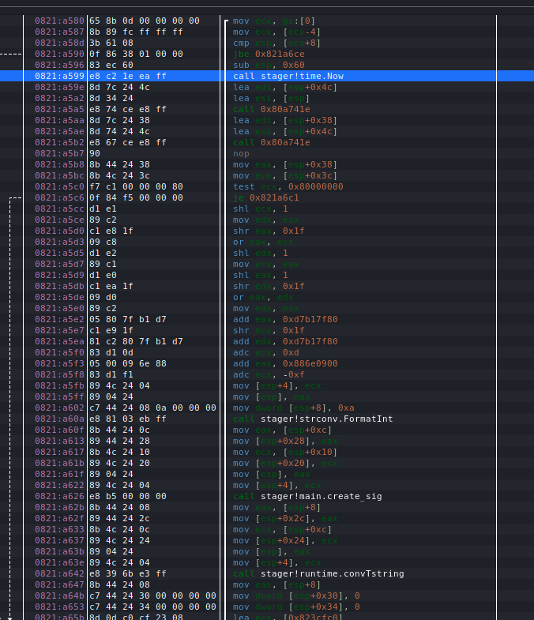

# Forensics 500 - NotTheEmpire

## Challenge Text:

We need your help Rebel. We have found some anomalous network traffic in our enviroment. We think that it is some sort of Command and Control Traffic associated with Empire malware.

The network traffic we are seeing is going out to [Here](https://challenges.silicon-ctf.party/for500/index.html). 

We think there is something hidden on this site that the malware has been reaching out to. 

We also recovered some samples of what we think to be early development versions of the malware. They are stored [here](https://challenges.silicon-ctf.party/for501/samples.zip)

## Hints: 

1. Have you found the uri that the samples are reaching out to? Does that exist on the potential C2 site? 

2. What are the headers being sent to the C2 site? Are there any patterns there? 

3. Take a look at how *UnionCryptoTrader* malware communicates with its C2 [Link to Paper](https://vx-underground.org/archive/APTs/2020/2020.01.08/Operation%20AppleJeus%20Sequel.pdf)

## How to solve: 

There are a couple ways to solve this one. For a more intuitive way than mine - check out Alex Loney's [write up](https://github.com/alexloney/SiliConCTF/tree/main/Forensics/500-NotTheEmpire). He did a great job with it. 

The way I went about it is slightly different: 

I will be looking at the file "stager" in my solution - both binaries are the same, just compiled for different operating systems.

stager = linux 
stager.exe = windows

First lets look at the file with strings: 

```
strings stager
```

There is a bunch of garbage here, but at the very beginning of the output there is a indicator that this binary has been packed with UPX.

```
❯ strings stager | head -n 10                                                                        
OUPX!
!N0F
@'N`
O`Q?>
NNN+4
?PwS
3B>S
EXjUkubcKsLL1k4csz/bw9B6MNkqj_gx
FZw4XfL/PKaUXHj8VC-P1oXuoqe(9
bM92o1vioiwXb_eNTr7
```

So in order to look at this in a decompiler, we need to unpack this binary. Luckily, that is really easy to do with UPX: 

```
upx -d stager
```

Now if we run strings, there is much more information. 

Let's open this up in edb and look at the functions: 

We can do this by starting edb and going to "Plugins" -> FunctionFinder


Lets search the executable space: 



There are a lot of functions found - it seems that the dev left all the debuggin functiosn for us. 

Let's start by looking for one of the standard entry functions: `main`:


There are three really interesting functions here: 

1. main.main
2. main.create_sig
3. main.send_GET

Lets start by looking at main.main 



Going through the assembly of main.main, we see a few key things: 

1. the binary gets the current time with `time.Now`
2. create_sig is called
3. send_GET is called (not pictured in screenshot)

Now lets look at create_sig:


Important things here: 
1. There is a hardcoded ascii value: `ai2@9fC31#59a!la{a`
2. Strings are concatenated
3. Something is calling the md5 hash library

So it is likely that the hard coded string is being concatenated with something. 

Lets set a breakpoint right after that concat string call and look at our registers. 


It looks like the epoch time which was calculated in main.main is concatenated with the hard coded string.

Lets then jump to the `main.send_GET` function. 


There are a couple things to note here: 

1. It looks like the binary is reaching out to `http://localhost:8235/c2`
2. there is a string `auth_timestamp`
3. there is a string `auth_signature` (not pictured above)

Let's see what traffic is being sent to that address. 

```
❯ nc -lvp 8235                     
listening on [any] 8235 ...
connect to [127.0.0.1] from localhost [127.0.0.1] 41104
GET /c2 HTTP/1.1
Host: localhost:8235
User-Agent: Go-http-client/1.1
Auth_signature: 8d8074187a1ed3d77381cdcc11f7eba0
Auth_timestamp: 1623213294
Accept-Encoding: gzip

```

This is interesting.

Lets take what we found out from looking into the binary and see if we can regenerate this hash. (Note - this is not needed to solve the challenge. We can just send these values, but for the sake of putting pieces togehter...)

If we take that `auth_timestamp` value and concate it with the hardcoded string we found: `1623213294ai2@9fC31#59a!la{a`

Now if we md5 hash that string: 

```
❯ echo -n '1623213294ai2@9fC31#59a!la{a' | md5sum
8d8074187a1ed3d77381cdcc11f7eba0  -
```

This hash matches the hash in the `Auth_Signature` header. 

We now know how the hash is generated. 

Lets now move to the website. What happens if we send the same request to the website in the challenge: 

```
~ ❯ curl -H 'User-Agent: Go-http-client/1.1' -H 'Auth_signature: 8d8074187a1ed3d77381cdcc11f7eba0' -H 'Auth_timestamp: 1623213294' -H 'Accept-Encoding: gzip' https://challenges.silicon-ctf.party/for500/c2
<!DOCTYPE html>
<!--
Template Name: Wavefire
Author: <a href="https://www.os-templates.com/">OS Templates</a>
Author URI: https://www.os-templates.com/
Copyright: OS-Templates.com
Licence: Free to use under our free template licence terms
Licence URI: https://www.os-templates.com/template-terms
-->
<html lang="en">

<head>
<title>Totally Normal Website</title>
<meta charset="utf-8">
<meta name="viewport" content="width=device-width, initial-scale=1.0, maximum-scale=1.0, user-scalable=no">

</head>
<body style="background-image: url('static/images/404.png'); background-size: auto; background-repeat: no-repeat; background-position: center fixed;">

</body>
</html>%
```
No dice. 

Thinking back to the challenge text, it does call out that the samples we are analyzing are dev samples. This probably means the engagement C2 infrastruture is more complex. Most likely it has a load balancer in front of the backend server. 

Nginx is a common loadbalancer. 

Nginx does this weird thing where it will replace underscores in headers with a hypen. [Link](https://github.com/ledgetech/lua-resty-http/issues/106)

Let's try that: 

```
~ ❯ curl -H 'User-Agent: Go-http-client/1.1' -H 'Auth-signature: 8d8074187a1ed3d77381cdcc11f7eba0' -H 'Auth-timestamp: 1623213294' -H 'Accept-Encoding: gzip' https://challenges.silicon-ctf.party/for500/c2
silicon{H3r3_7s_UR_P@yl0ad}%
```
