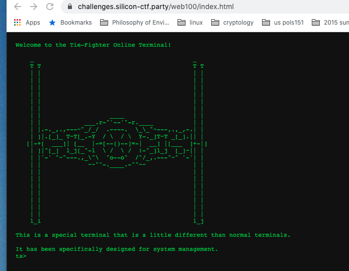
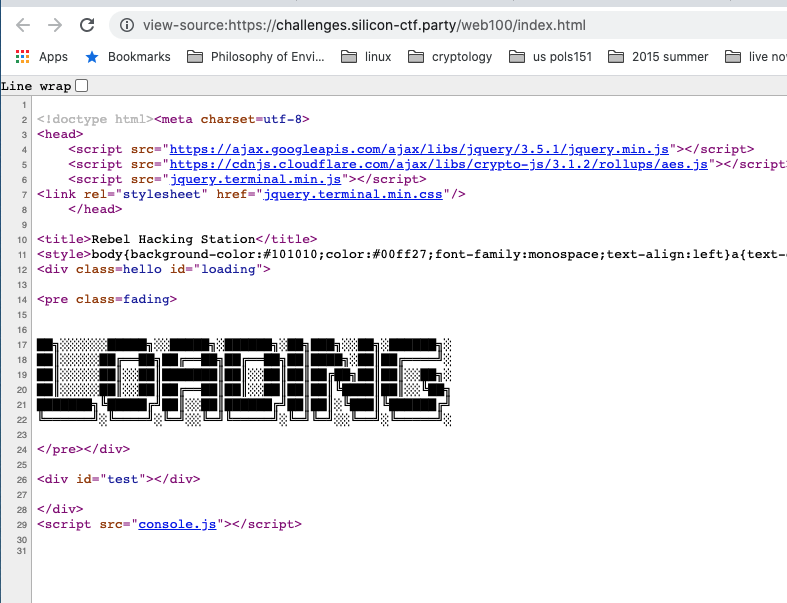
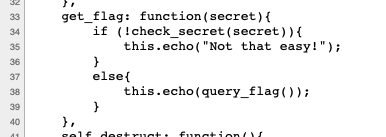
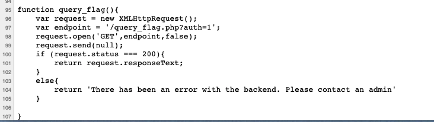
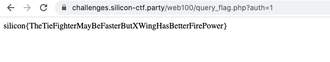

# Web 100 - Tie Fighter Terminal

## Challenge Text: 
We have gained access to a Tie Fighter terminal. We are having trouble derving any information from it. Check it out to see what you can find. 

## Hint:

Follow the source (javascript)

## How to solve: 

Go to the Tie Fighter terminal page: 

Look at the source code by right-clicking the page and selecting "view page source"

In the source code you can see a couple of `<script>` tags that bring in javascript to the site. 

The one that stands out is the `console.js` file on line 29. As it is not a standard javascript library. 

You can look at this code by clicking on that link or going to `https://challenges.silicon-ctf.party/web100/console.js`. 

This is the code that tells the javascript terminal how to respond to certian commands. 

On line 33 there seems to be a function config for `get_flag`:

We can see that the flag is loaded with the function call on line 36: `query_flag`. 

We can find this function later in the file:

This function is making a get request to the `/query_flag.php` resource and passing the variable `auth=1` This can be seen in line 97. 

If we replicate that request, we get the flag: 

