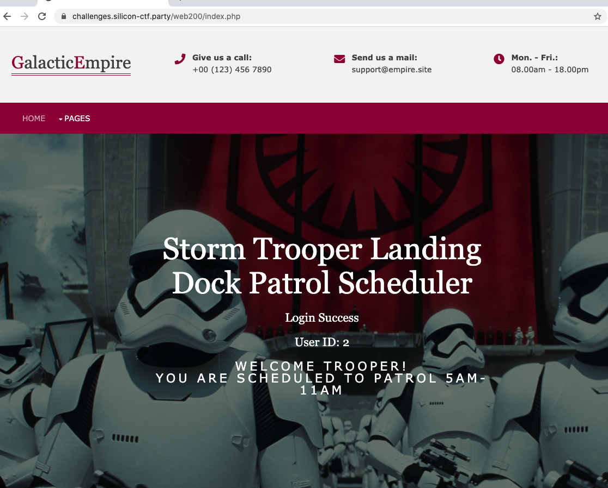
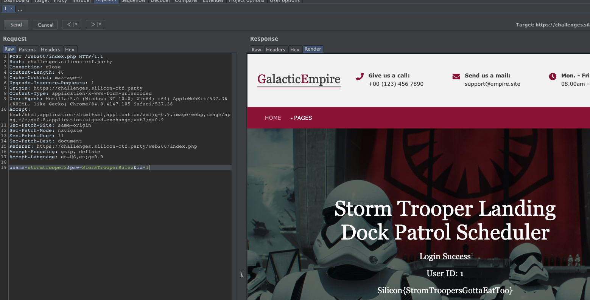

# Web 200 - Landing Dock Patrol

## Challenge Text

To sneak Rebels on to the Death Star, we need to know when the dock is going to be unguarded. A successful phishing campagin got us some credentials to the Patrol Scheduling website. Unfortunately, these creds only get us one schedule. We need adminstrative access.

Your our only hope...

Username: stormtrooper2

Password: StormTrooperRulez

## Hint

Inspect the data you are sending to the server. Is there anything there you could manipulate? 

You can use [Burp](https://portswigger.net/burp/communitydownload) to look at the data you are sending. 

## How to Solve

This is a vulnerability that we have seen in practice before - so we wanted to emulate it for the CTF. 

First open up Burp Suite and navigate to the page: 

(it is best to do this by going to the proxy tab in Burp Suite, turn `intercept` off, then hit `Open Browser`)

Login with the credentials provided in the challenge. 

Head over to the `HTTP History` tab in the `Proxy` section of Burp Suite. Here you will see all of the traffic going through your browser. 

Find the login request:

We can see in this request, there are three parameters being sent (line 19): 

`uname = stormtrooper2`
`psw = StormTrooperRulez`
`id = 2`

Lets manipulate this request. 

Right click on the request and hit "send to repeater". This will allow us to modify the request and send it to the server again.

Go to the Repeater tab: 

With most web applications, the admin user will have an id = 1. If we change `id=2` to `id=1` and hit send:

